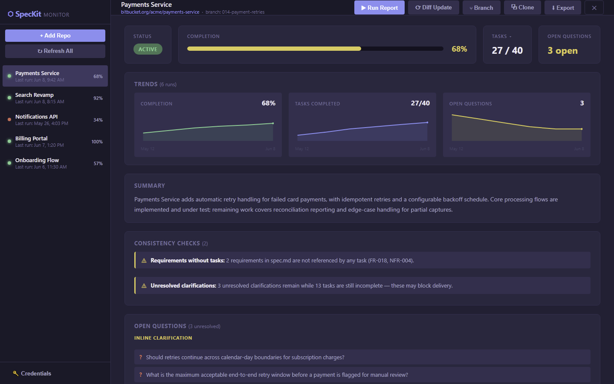

# ⬡ SpecKit Monitor

> **See where every feature really stands.**



SpecKit Monitor turns your spec-driven repositories into a living product dashboard. Point it at any Bitbucket repo — Cloud or self-hosted Server / Data Center — pick a feature branch, and it reads the [SpecKit](https://github.com/github/spec-kit) artifacts straight from source: the constitution, `spec.md`, `plan.md`, `tasks.md`, and validation checklists. In seconds you get an honest, at-a-glance picture: completion percentage, task burn-down, stall detection, open questions, and governing principles — no status meetings required.

It's more than a status readout. SpecKit Monitor runs lightweight **traceability checks** that flag requirements with no tasks, tasks with no linked requirement, and unresolved `[NEEDS CLARIFICATION]` markers that could block a phase. A GitHub Models (gpt-4o) pass adds a plain-English summary, recent-activity digest, and constitution **alignment concerns** — so you catch drift between what was promised and what's being built. Every run is snapshotted into a time series, rendering **trend charts** for completion, tasks, and open questions, because direction matters more than a single number.

When it's time to report up, one click exports a polished **Markdown or PDF** report — simple or detailed — or fires a **stakeholder digest** across every watched project straight to a Slack or Teams webhook. Browse and search your whole repo catalog to add new projects, clone an entry to track a second branch, reorder by priority, and archive the ones that have shipped.

---

## ⬇ Download

**Windows (portable):** grab the latest zip from the **[Releases page](https://github.com/travis-ellis/speckit-monitor/releases/latest)**, unzip it anywhere, and run **`SpecKit Monitor.exe`**. No installer required.

State (watched repos, encrypted credentials, snapshots) is stored under `%USERPROFILE%\.speckit-monitor`.

---

## ✨ Features

- **Multi-host Bitbucket support** — Cloud (`bitbucket.org`) and self-hosted Server / Data Center, with per-feature **branch** selection.
- **Repo browser** — search and pick from every repo your credentials can see, instead of pasting URLs.
- **Progress at a glance** — completion %, task completed/total, open-question count, and 14-day stall detection.
- **Spec intelligence** — parsed **constitution** principles, **validation checklists** (pass/fail), and AI-flagged constitution **alignment concerns**.
- **Traceability checks** — requirements without tasks, tasks without a linked requirement, and unresolved clarifications that may block delivery.
- **Trend charts** — completion, tasks-completed, and open-questions plotted over time from a stored snapshot history.
- **Diff mode** — see exactly what changed since the last run.
- **Export & share** — Markdown / PDF report export (simple or detailed) and a multi-repo **digest** with Slack/Teams webhook delivery.
- **Organize** — drag-to-reorder, clone a watch entry (track another branch), and archive shipped projects.
- **Desktop GUI + CLI** — a polished Electron app and a Commander-based command line sharing one core.
- **Secrets sealed at rest** — credentials and tokens encrypted with Windows DPAPI (current-user scope).

---

## 🛠 Build from source

### Prerequisites
- **Node.js 18+** (developed on Node 24 LTS)
- Windows (the packaged target and DPAPI secret store are Windows-specific; the core/CLI is cross-platform)

### Setup
```bash
npm install
npm run build
```

### Run the desktop app
```bash
npm run gui
```

### Run the CLI
```bash
# Full report for a repo on a feature branch
npm start -- report https://bitbucket.org/workspace/repo --branch 001-some-feature

# Other commands
npm start -- add <url> --branch <name>
npm start -- list
npm start -- diff <url-or-alias>
npm start -- auth
```

### Package the portable Windows app
```bash
npm run package
```
Output: `release/win-unpacked/` — run `SpecKit Monitor.exe`.

---

## 🔑 Credentials

On first run you'll be asked for:

- **Bitbucket** — an App Password (Cloud) or HTTP access token (Server) with **Repositories: Read**.
- **GitHub** — a Personal Access Token for **GitHub Models** (gpt-4o); no special scopes needed for public access.

Both are encrypted at rest via DPAPI and never stored in plaintext.

---

## 🧱 How it's built

A portable **Electron + TypeScript** app with a shared core driving both a desktop GUI and a Commander-based CLI. A typed pipeline keeps logic testable and the front-ends thin:

```
Bitbucket REST fetchers → markdown parsers → analysis engine → reporter / renderer
```

- **`src/bitbucket.ts`** — Cloud (v2.0) + Server (v1.0) fetchers, repo/branch listing, SpecKit layout discovery.
- **`src/parser.ts`** — markdown parsing for tasks, open questions, project artifacts, constitution, checklists, and consistency checks.
- **`src/analyzer.ts`** — assembles a token-budgeted context and calls GitHub Models for summary + alignment concerns.
- **`src/state.ts`** — JSON state, DPAPI-encrypted secrets, and the per-repo snapshot/trend history.
- **`src/electron/`** + **`renderer/`** — IPC handlers, preload bridge, and a dependency-free renderer (charts are hand-rolled inline SVG).

The whole thing ships as a single self-contained build — no chart libraries, locale files trimmed to `en-US`, and electron-builder pruned to production dependencies.

---

## 📦 Tech stack

Electron · TypeScript · Commander · axios · OpenAI SDK (GitHub Models endpoint) · chalk · electron-builder

## 📄 License

ISC
